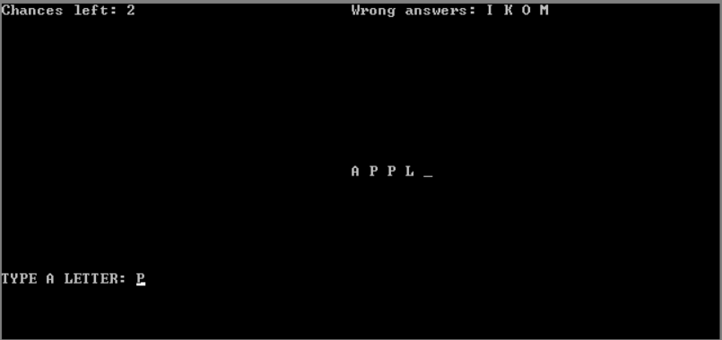

# 🕹️ Hangman Game in x86 Assembly (EMU8086)

A classic **Hangman** word-guessing game implemented entirely in **x86 Assembly**, designed to run in the **EMU8086** emulator. This project is a fun way to explore low-level programming concepts while building an interactive text-based game.

---

## 🚀 Features

- 🎮 Mouse-based interface for navigation
- 🧠 Word guessing logic with real-time feedback
- 📉 Tracks remaining chances and wrong guesses
- 🏆 Win and Lose end screens
- 🔠 Works in text mode for compatibility with EMU8086

---

## 📸 Screenshots

| First Screen | Level Selection | Game Interface |
|--------------|-----------------|----------------|
|  |  |  |

---

## 🧠 How to Play

1. Run the program in EMU8086.
2. Click on **START** using the mouse.
3. Select **LEVEL 1** (more levels can be added).
4. Enter your letter guesses using the keyboard.
5. You win by guessing all letters correctly.
6. You lose if you run out of 6 chances.
